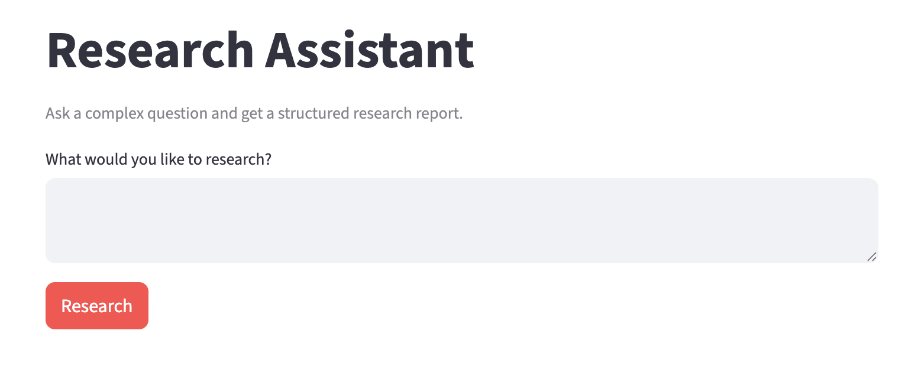
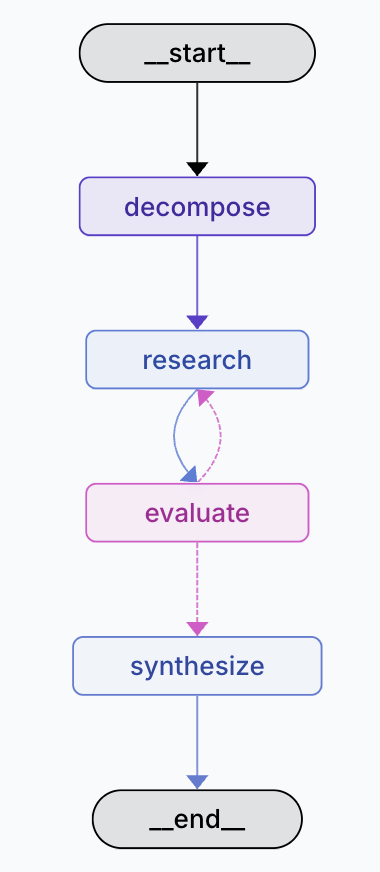

# Research Assistant

A LangGraph-powered agent that breaks down complex questions, iteratively searches the web, and synthesizes findings into a structured report.

## Screenshots

### Streamlit UI


### LangGraph Studio


---

## How it works

The assistant uses an iterative refinement loop with four nodes:

```
[START]
   │
   ▼
┌─────────────┐
│  decompose  │  Break the question into 2–4 focused sub-queries
└──────┬──────┘
       │
       ▼
┌─────────────┐
│   research  │  Search the web (Tavily) for each sub-query
└──────┬──────┘
       │
       ▼
┌─────────────┐     ┌─────────────┐
│  evaluate   │────▶│   research  │  Re-search with targeted queries
│   quality   │gaps  │  (refine)   │  (max 2 refinement loops)
└──────┬──────┘     └─────────────┘
       │ sufficient (or max loops reached)
       ▼
┌─────────────┐
│  synthesize │  Combine all findings into a structured report
└──────┬──────┘
       │
     [END]
```

**Node descriptions:**

| Node | What it does |
|------|-------------|
| `decompose` | Calls Claude to split the question into 2–4 distinct sub-queries |
| `research` | Runs a Tavily web search for each sub-query (top 3 results each) |
| `evaluate` | Calls Claude to assess result quality — returns `"sufficient"` or `"gaps: ..."` |
| `synthesize` | Calls Claude to produce a final report: executive summary, key findings, sources |

**Refinement loop:** if `evaluate` finds gaps and fewer than 2 refinement iterations have run, the graph loops back to `research` with new targeted queries. After 2 loops (or when results are sufficient), it moves to `synthesize`.

---

## Tech stack

| Tool | Purpose |
|------|---------|
| Python 3.12+ | Runtime |
| [uv](https://docs.astral.sh/uv/) | Dependency management and virtual environment |
| [LangGraph](https://langchain-ai.github.io/langgraph/) | Stateful agent workflow orchestration |
| [LangChain](https://docs.langchain.com/) + langchain-anthropic | LLM integrations (Claude Sonnet 4) |
| [Tavily](https://tavily.com/) | Web search API |
| [Streamlit](https://streamlit.io/) | Frontend UI |

---

## Project structure

```
research-assistant/
├── src/
│   ├── app.py          # Streamlit entry point
│   ├── graph.py        # LangGraph workflow definition
│   ├── nodes.py        # Node functions (decompose, research, evaluate, synthesize)
│   ├── state.py        # ResearchState TypedDict schema
│   └── prompts.py      # All LLM prompt templates
├── langgraph.json      # LangGraph API / Studio config
├── pyproject.toml      # Dependencies (uv)
└── .env                # API keys (not committed)
```

---

## Setup

### 1. Install uv

```bash
curl -LsSf https://astral.sh/uv/install.sh | sh
```

### 2. Clone and install dependencies

```bash
git clone <repo-url>
cd research-assistant
uv sync
```

### 3. Configure API keys

Create a `.env` file in the project root:

```env
ANTHROPIC_API_KEY=sk-ant-...
TAVILY_API_KEY=tvly-...
```

- Anthropic API key: https://console.anthropic.com/
- Tavily API key: https://tavily.com/ (free tier available)

### 4. Run the app

```bash
uv run streamlit run src/app.py
```

---

## LangGraph Studio

LangGraph Studio provides a visual graph debugger where you can inspect state at each node, step through the workflow, and replay runs.

The graph is already registered in `langgraph.json` as `research_assistant`. To launch:

```bash
uv run langgraph dev
```

Then open [LangGraph Studio](https://smith.langchain.com/studio) and connect to `http://localhost:2024`.

---

## Example questions

| Type | Question |
|------|---------|
| Simple | "What is the current state of fusion energy research?" |
| Multi-faceted | "Compare the economic, environmental, and social impacts of remote work adoption since 2020" |
| Requires refinement | "How are different countries approaching AI regulation, and what are the key differences between the EU AI Act and the US executive order on AI?" |
